<h1><picture>
  <source media="(prefers-color-scheme: dark)" srcset="./lib/assets/wordmark.dark.png?raw=true">
  <source media="(prefers-color-scheme: light)" srcset="./lib/assets/wordmark.light.png?raw=true">
  
</picture></h1>

[][releases]
[](https://github.com/mastodon/mastodon/actions/workflows/test-ruby.yml)
[][crowdin]

[releases]: https://github.com/mastodon/mastodon/releases
[crowdin]: https://crowdin.com/project/mastodon

Mastodon is a **free, open-source social network server** based on ActivityPub where users can follow friends and discover new ones. On Mastodon, users can publish anything they want: links, pictures, text, and video. All Mastodon servers are interoperable as a federated network (users on one server can seamlessly communicate with users from another one, including non-Mastodon software that implements ActivityPub!)

Click below to **learn more** in a video:

[][youtube_demo]

[youtube_demo]: https://www.youtube.com/watch?v=IPSbNdBmWKE

## Navigation

- [Project homepage 🐘](https://joinmastodon.org)
- [Support the development via Patreon][patreon]
- [View sponsors](https://joinmastodon.org/sponsors)
- [Blog](https://blog.joinmastodon.org)
- [Documentation](https://docs.joinmastodon.org)
- [Roadmap](https://joinmastodon.org/roadmap)
- [Official Docker image](https://github.com/mastodon/mastodon/pkgs/container/mastodon)
- [Browse Mastodon servers](https://joinmastodon.org/communities)
- [Browse Mastodon apps](https://joinmastodon.org/apps)

[patreon]: https://www.patreon.com/mastodon

## Features


### No vendor lock-in: Fully interoperable with any conforming platform

It doesn't have to be Mastodon; whatever implements ActivityPub is part of the social network! [Learn more](https://blog.joinmastodon.org/2018/06/why-activitypub-is-the-future/)

### Real-time, chronological timeline updates

Updates of people you're following appear in real-time in the UI via WebSockets. There's a firehose view as well!

### Media attachments like images and short videos

Upload and view images and WebM/MP4 videos attached to the updates. Videos with no audio track are treated like GIFs; normal videos loop continuously!

### Safety and moderation tools

Mastodon includes private posts, locked accounts, phrase filtering, muting, blocking, and all sorts of other features, along with a reporting and moderation system. [Learn more](https://blog.joinmastodon.org/2018/07/cage-the-mastodon/)

### OAuth2 and a straightforward REST API

Mastodon acts as an OAuth2 provider, so 3rd party apps can use the REST and Streaming APIs. This results in a rich app ecosystem with a lot of choices!

## Deployment

### Tech stack

- **Ruby on Rails** powers the REST API and other web pages
- **React.js** and Redux are used for the dynamic parts of the interface
- **Node.js** powers the streaming API

### Requirements

- **PostgreSQL** 9.5+
- **Redis** 4+
- **Ruby** 2.7+
- **Node.js** 16+

The repository includes deployment configurations for **Docker and docker-compose** as well as specific platforms like **Heroku**, **Scalingo**, and **Nanobox**. For Helm charts, reference the [mastodon/chart repository](https://github.com/mastodon/chart). The [**standalone** installation guide](https://docs.joinmastodon.org/admin/install/) is available in the documentation.

## Development

### Install Windows Terminal

```
https://learn.microsoft.com/en-us/windows/terminal/install
```

### Setup up Windows Subsystem for Linux (WSL) with Ubuntu

- Install Windows Subsystem for Linux (WSL) this will also install Ubuntu

```
wsl --install
```

- Setting WSL2 for your linux distros

```
wsl --set-default-version 2
```

Check the WSL version installed on Windows 10 or 11

```
wsl --list --verbose
NAME                   STATE           VERSION
* docker-desktop-data    Running         2
  Ubuntu                 Running         2
  docker-desktop         Running         2
  Ubuntu-20.04           Stopped         2
```

### Troubleshooting WSL problems

- Windows feature Windows Subsystem for Linux is turned off

Check if the Windows feature Windows Subsystem for Linux is turned off

```
Control panel ->
  Program and Featrues ->
    Turn Windows features on or off ->
      Windows Subsystem for Linux (Check this box)
```

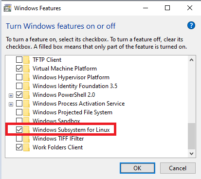

- CPU virtualization is disabled in BIOS

If you encounter this error when opening Power Shell or Ubuntu från Windows Terminal

```
Installing this may take a few minutes
WslRegisterDistrubution failed with error: 0x80370102
Please enable the Virtual Machine Platform Windows feature and ensure virtualization is enabled in the BIOS.
for information please visit https://aka.ms/enablevirtualization
Press any key to continue...
```

It means that the CPU virtualization is disabled in BIOS and must be enabled, follow tutorial link

```
https://www.bleepingcomputer.com/tutorials/how-to-enable-cpu-virtualization-in-your-computer-bios/
```

More information can be found here

```
https://aka.ms/enablevirtualization
```

### Create ssh keys for bitbucket repo in WSL Ubuntu

- Open Ubuntu shell from Windows Terminal and create ssh keys

```
ssh-keygen -t rsa -b 2048
Generating public/private rsa key pair.
Enter file in which to save the key (/home/maw/.ssh/id_rsa):
Enter passphrase (empty for no passphrase):
Enter same passphrase again:
Your identification has been saved in /home/maw/.ssh/id_rsa
Your public key has been saved in /home/maw/.ssh/id_rsa.pub
```

- The generated private/public keys are stored in home directory

```
maw@maw:/$ ls -l /home/maw/.ssh/
-rw------- 1 maw maw 3401 Oct 18 11:14 id_rsa
-rw-r--r-- 1 maw maw  756 Oct 18 11:14 id_rsa.pub
```

- Copy the content of public key <span style="color:green"><b>id_rsa.pub</b></span> to bitbucket

```
https://bitbucket.org/account/settings/ssh-keys/
```

### Clone this repo into WSL Ubuntu

```
/home/maw/projects
maw@maw:~/projects$ git clone git@bitbucket.org:softhouse/trust-social.git
```

### Install and config Docker Desktop with WSL support for Windows

```
https://docs.docker.com/desktop/install/windows-install/
```

- WSL 2 based engine

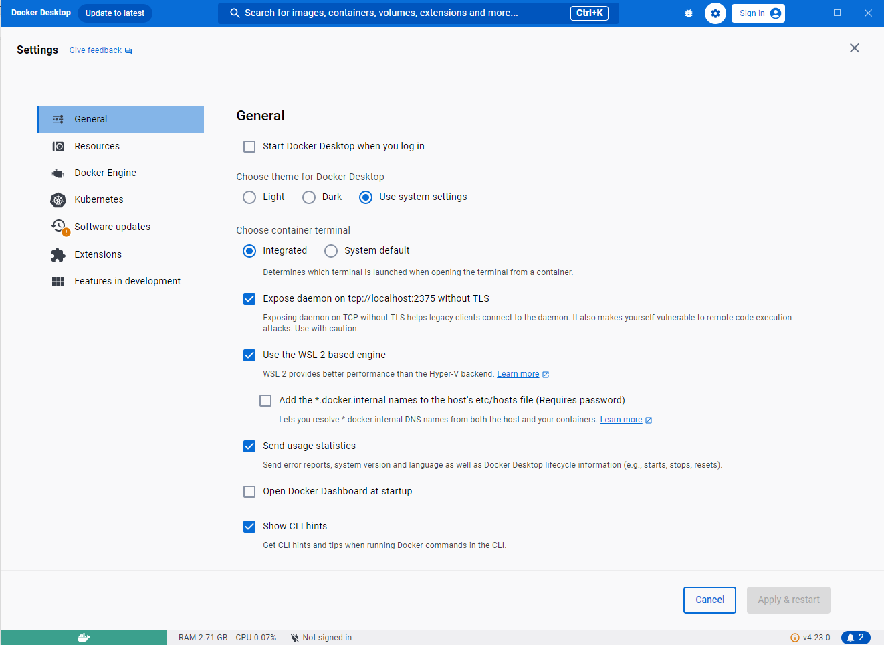

- WSL Integration

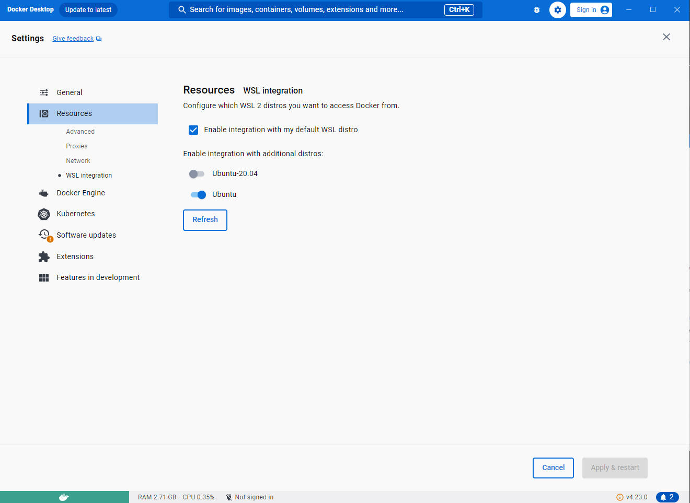

### Open trust-social project with Intellij on Windows from WSL Ubuntu

```
\\wsl$\Ubuntu\home\maw\projects\trust-social
```

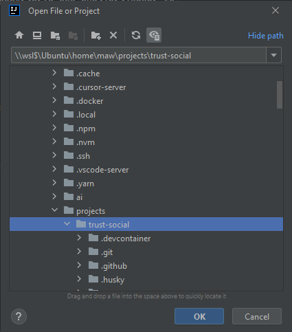

### Open trust-social project from within WSL Ubuntu with vscode

- Install vscode Remote Development WSL extension

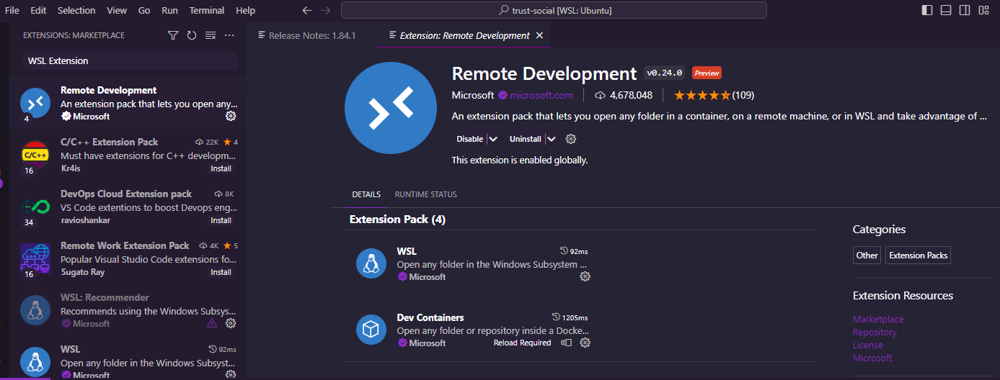

- Start trust-social project from WSL Ubuntu

```
code . # will install necessary software and start vscode on Windows
```

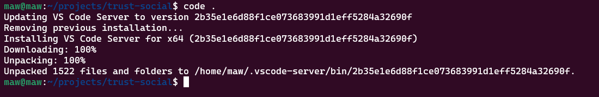

### Docker - start containers and application

For development with **Docker**, complete the following steps:

- Run to setup and start up the containers `docker compose -f .devcontainer/docker-compose.yml up -d`
- <del>Run `docker compose -f .devcontainer/docker-compose.yml exec app .devcontainer/post-create.sh`</del> This did not work follow below
- <del>Finally, run `docker compose -f .devcontainer/docker-compose.yml exec app foreman start -f Procfile.dev`</del> This did not work follow below

- You have to list running docker containers to get the proper service NAMES

```
docker ps

CONTAINER ID IMAGE COMMAND CREATED STATUS PORTS NAMES
/*                                           */ devcontainer-es-1
/*                                           */ devcontainer-redis-1
/*                                           */ devcontainer-libretranslate-1
/*                                           */ devcontainer-db-1
/*                                           */ devcontainer-app-1
```

This is the service we are looking for
<span style="color:green"><b>devcontainer-app-1</b></span>

- Log into your docker service

```
docker exec -it devcontainer-app-1 /bin/bash
```

- Inside the docker container

```
cd workspaces/trust-social/
```

- Run this command to setup the enviroment

```
.devcontainer/post-create.sh
```

- To start the all processes inside docker container

```
docker exec -it devcontainer-app-1 /bin/bash
```

- Inside the docker container

```
cd workspaces/trust-social/
```

- Run this command to start the application

```
foreman start -f Procfile.dev
```

### Troubleshooting the setup and start up of the application

- If the startup fails with errors

```
...
Unable to load application: SignalException: SIGTERM
terminated by SIGTERM
terminated by SIGTERM
```

- Run the Git dubious ownership suggestion

```
fatal: detected dubious ownership in repository at '/workspaces/trust-social'
To add an exception for this directory, call:
git config --global --add safe.directory /workspaces/trust-social
```

- Rerun the setup of the enviroment again

```
.devcontainer/post-create.sh
```

- Rerun the start up of the application

```
foreman start -f Procfile.dev
```

### Accessing the application

[http://localhost:3000](http://localhost:3000)

### Verify the newly created account

[http://localhost:3000/letter_opener](http://localhost:3000/letter_opener)

### Docker commands

- Start new containers or update existing ones based on your configuration

```
docker-compose up -d
```

- Stop and remove containers, networks, and volumes completely

```
docker-compose down
```

- Resume previously stopped containers

```
docker-compose start
```

- Temporarily stop containers without removing them

```
docker-compose stop
```

### Config firewall to open ports

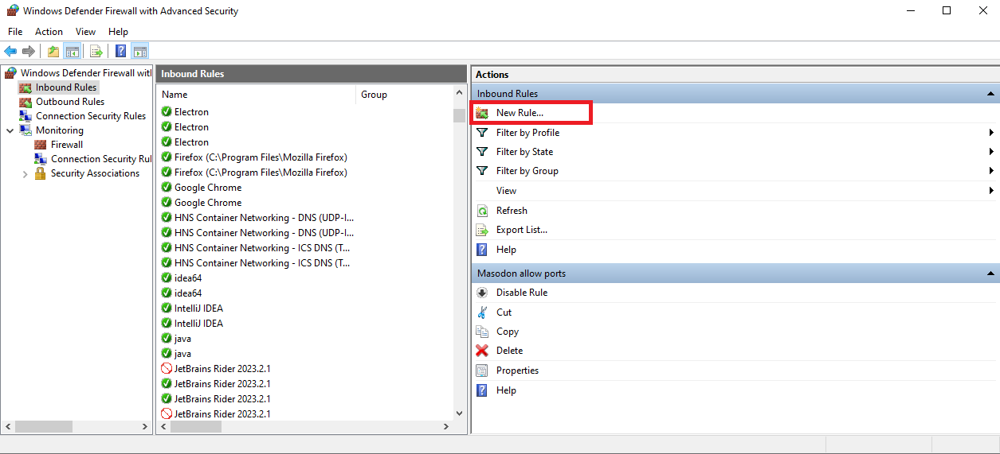
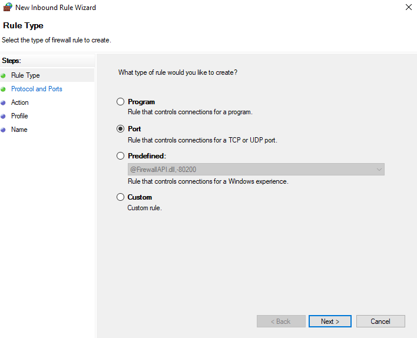
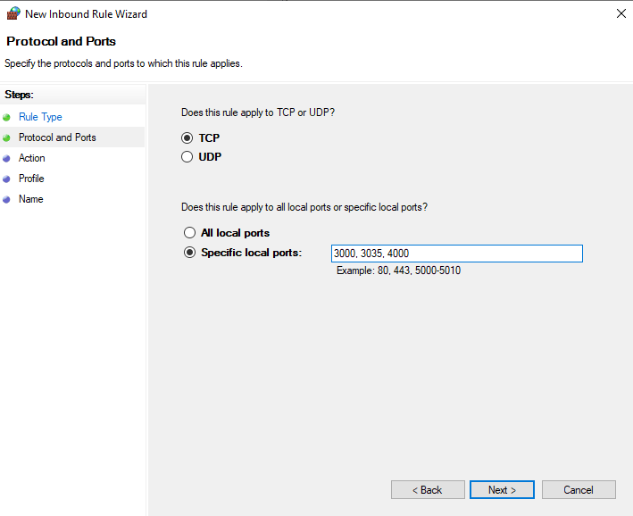
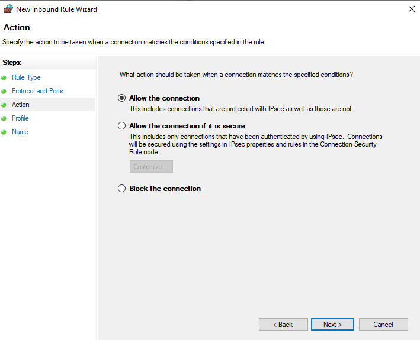
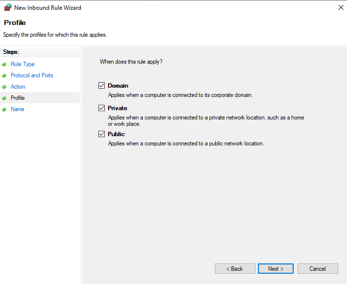
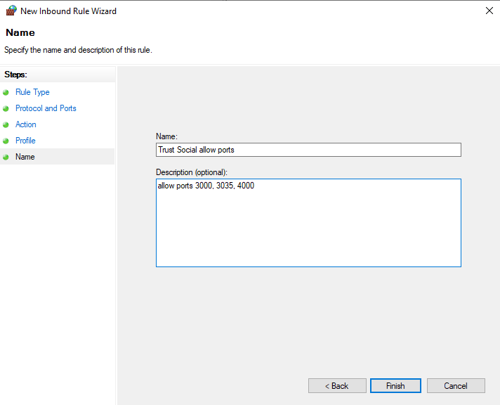

### Vagrant

A **Vagrant** configuration is included for development purposes. To use it, complete the following steps:

- Install Vagrant and Virtualbox
- Install the `vagrant-hostsupdater` plugin: `vagrant plugin install vagrant-hostsupdater`
- Run `vagrant up`
- Run `vagrant ssh -c "cd /vagrant && foreman start"`
- Open `http://mastodon.local` in your browser

### MacOS

To set up **MacOS** for native development, complete the following steps:

- Install the latest stable Ruby version (use a Ruby version manager for easy installation and management of Ruby versions)
- Run `brew install postgresql@14`
- Run `brew install redis`
- Run `brew install imagemagick`
- Install Foreman or a similar tool (such as [overmind](https://github.com/DarthSim/overmind)) to handle multiple process launching.
- Navigate to Mastodon's root directory and run `brew install nvm` then `nvm use` to use the version from .nvmrc
- Run `corepack enable && yarn set version classic`
- Run `bundle exec rails db:setup` (optionally prepend `RAILS_ENV=development` to target the dev environment)
- Finally, run `overmind start -f Procfile.dev`

If you are using an IDE with [support for the Development Container specification](https://containers.dev/supporting), it will run the above `docker compose` commands automatically. For **Visual Studio Code** this requires the [Dev Container extension](https://containers.dev/supporting#dev-containers).

### GitHub Codespaces

To get you coding in just a few minutes, GitHub Codespaces provides a web-based version of Visual Studio Code and a cloud-hosted development environment fully configured with the software needed for this project..

- Click this button to create a new codespace:<br>
  [](https://github.com/codespaces/new?hide_repo_select=true&ref=main&repo=52281283&devcontainer_path=.devcontainer%2Fcodespaces%2Fdevcontainer.json)
- Wait for the environment to build. This will take a few minutes.
- When the editor is ready, run `foreman start -f Procfile.dev` in the terminal.
- After a few seconds, a popup will appear with a button labeled _Open in Browser_. This will open Mastodon.
- On the _Ports_ tab, right click on the “stream” row and select _Port visibility_ → _Public_.

## Contributing

Mastodon is **free, open-source software** licensed under **AGPLv3**.

You can open issues for bugs you've found or features you think are missing. You can also submit pull requests to this repository or submit translations using Crowdin. To get started, take a look at [CONTRIBUTING.md](CONTRIBUTING.md). If your contributions are accepted into Mastodon, you can request to be paid through [our OpenCollective](https://opencollective.com/mastodon).

**IRC channel**: #mastodon on irc.libera.chat

## License

Copyright (C) 2016-2023 Eugen Rochko & other Mastodon contributors (see [AUTHORS.md](AUTHORS.md))

This program is free software: you can redistribute it and/or modify it under the terms of the GNU Affero General Public License as published by the Free Software Foundation, either version 3 of the License, or (at your option) any later version.

This program is distributed in the hope that it will be useful, but WITHOUT ANY WARRANTY; without even the implied warranty of MERCHANTABILITY or FITNESS FOR A PARTICULAR PURPOSE. See the GNU Affero General Public License for more details.

You should have received a copy of the GNU Affero General Public License along with this program. If not, see <https://www.gnu.org/licenses/>.
